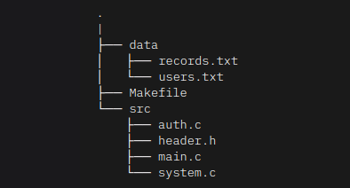

# atm-management

In this project, we learn about programming in C.
We're not asked to create the code from scratch, we "just" have to add features or fix the code of the given application.

The program we have to make is a basic ATM managment system in which users are able to :
- Login/Register.
- Create new accounts. 
- Check the list/details of existing accounts. 
- Update informations of existing accounts. 
- Remove existing accounts. 
- Make transactions on a specified account.
- Transfer ownership of an account from a user to another one.  

## Program structure and how to run it 

### Data folder

- The records.txt file contains all the created accounts and the informations about them.
- The users.txt file contains all the created users and their password. 

### Src folder
- Contains all the C code.

### Makefile
- The makefile is used to build the executable to run the program.

### How to run the program
- In the terminal in the atm-system directory use the command "make" to build the atm executable, then in the src directory use the command "./atm" to run it.
Once you made those small operations, you just need to follow the instructions displayed on your screen.

## License 

